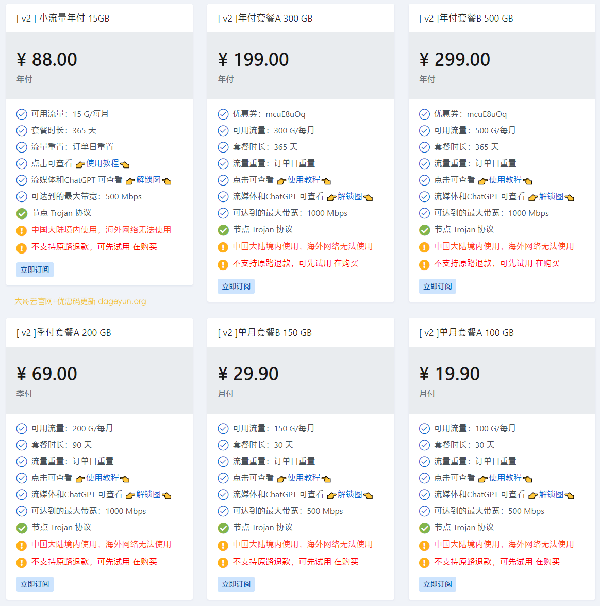

# 大哥云官网地址2025最新入口+优惠码

大哥云跑路了吗？暂时没有。不过机场总会有跑路风险，为尽可能减少损失，选购套餐可按月支付。下面是最新地址：

大哥云官网永久地址：[dageyun.com](https://dageyun.org/out/dage)

地址1：[https://2024la.com](https://aff02.dgy01.com/#/register?code=3jP2Cuqu)

地址2：[https://2025la.com](https://dageyun.org/out/dage)

## 简介

大哥云机场，价格便宜，低至￥7+一个月，线路带宽充裕不拥挤。

支持SSR、V2ray节点，国内中转节点，解锁流媒体，CN2/BGP隧道中转和IPLC国际专线节点。

## 大哥云优惠码

大哥云优惠码：

大哥云加速2025新年特惠包年8折优惠代码：[20250101](https://dageyun.org/out/dage)

## 大哥云怎么样？

大哥云VPN加速器，提供Trojan协议及V2Ray协议翻墙机场节点，支持一键导入支持Clash、Shadowrocket、小火箭等翻墙插件。

## 大哥云优惠套餐

| 大哥云 | 付款周期 | 价格 | 每月流量 | 同时在线 |
| --- | --- | --- | --- | --- |
| VIP1 小流量 | 按年付 | 88.00 | 15 GB | 无限制 |
| 套餐A | 按月付 | 19.90 | 100 GB | 无限制 |
| 套餐A | 按季付 | 69.00 | 200 GB | 无限制 |
| 套餐A | 按年付 | 199.00 | 300 GB | 无限制 |
| 套餐B | 按月付 | 29.90 | 150 GB | 无限制 |
| 套餐B | 按季付 | 129.00 | 300 GB | 无限制 |
| 套餐B | 按年付 | 299.00 | 500 GB | 无限制 |

